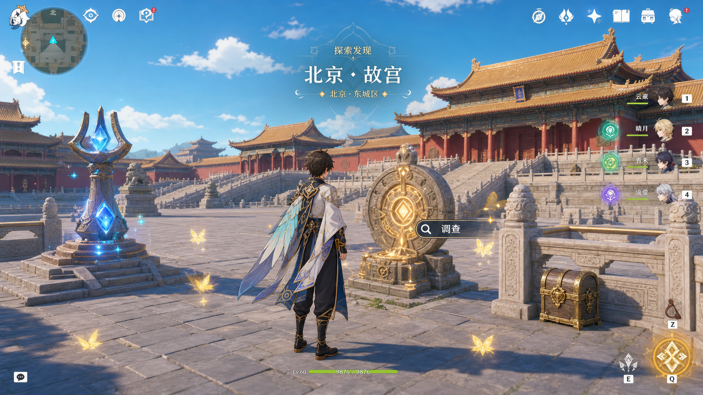
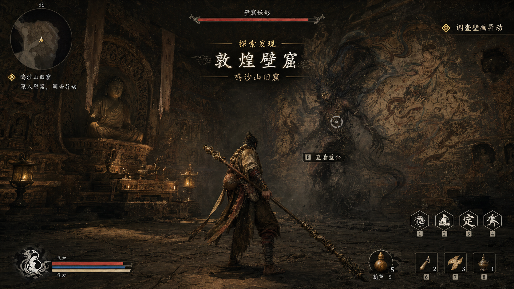
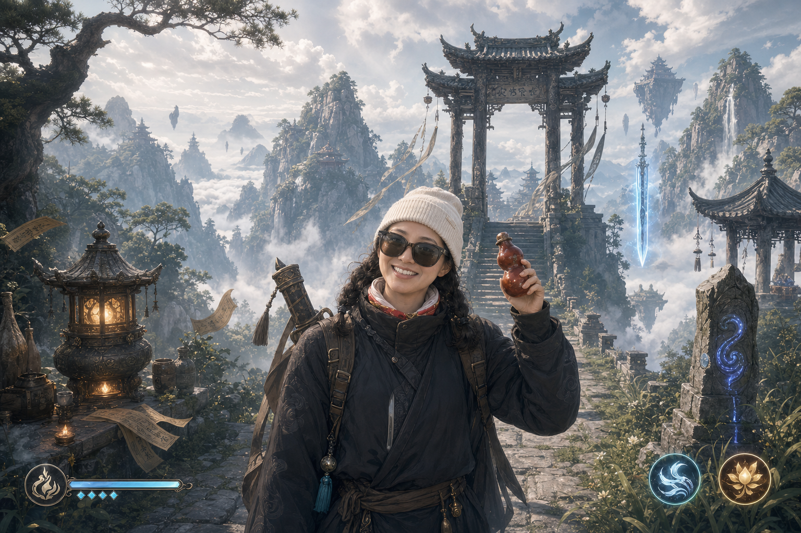
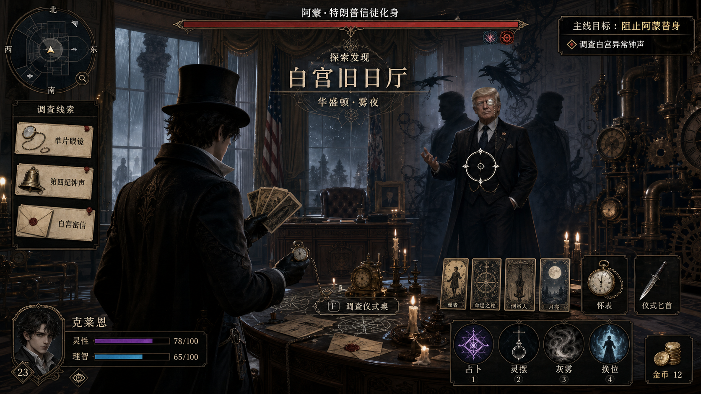
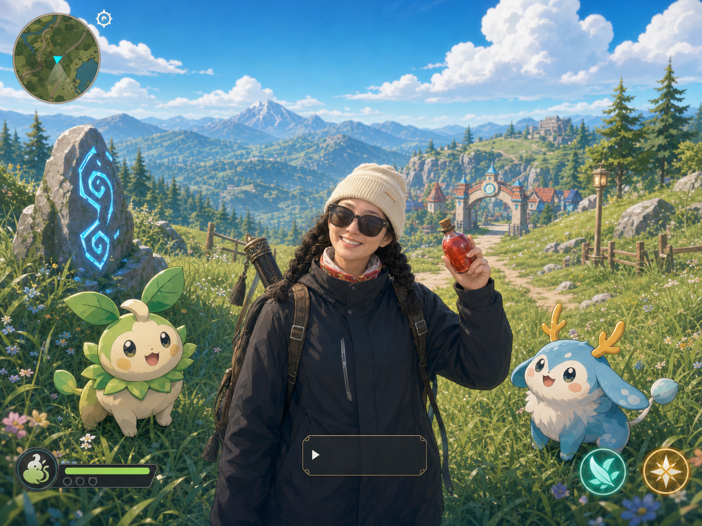
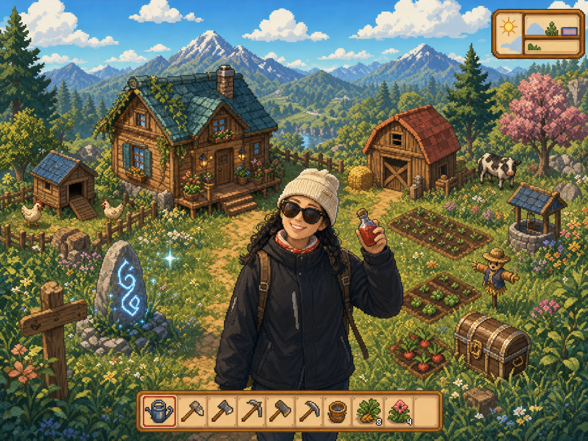
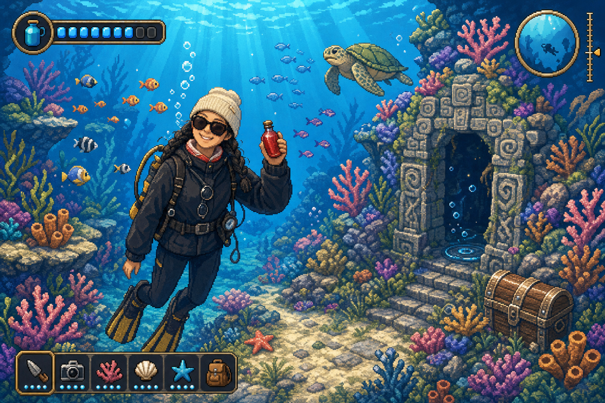

# Multi Style Image Generator

[English README](README_en.md)

面向 Codex 的多风格图片生成 skill。它把常见的视觉风格路由、提示词结构、上传照片参考、游戏 UI 模式和 360 环景预览整理成一套稳定工作流，适合快速生成风格统一、主体清晰、可继续迭代的视觉方案。

如果这个项目对你有帮助，欢迎在 GitHub 上 Star 支持后续更新。

## 作者与交流

- 微信：loonges
- 小红书 / 抖音：好奇的小逸

## 生成效果

以下示例展示不同视觉方向的生成效果。实际结果会随输入主体、参考图和模型状态变化。

| 开放世界奇幻冒险 | 暗黑中式神话 |
|---|---|
|  |  |

| 东方修仙 / 仙侠 | 维多利亚蒸汽神秘学 |
|---|---|
|  |  |

| 彩色怪物收集冒险 | 温暖像素农场 |
|---|---|
|  |  |

| 像素海底冒险 | 360 环景预览 |
|---|---|
|  | [查看 360 环景动态示例](assets/examples/cultivation-360-panorama.mov) |

## 核心能力

- 直接出图：根据中文请求生成目标风格图片。
- 只写提示词：在“不用出图 / 只写 prompt / 写提示词”场景下输出结构化提示词。
- 上传照片参考：支持一张图参考场景，另一张图参考人物身份；保留指定穿着、墨镜、帽子、道具和姿势。
- 统一画风重绘：上传真人照片时，人物、脸、衣服、道具和背景会被要求统一转译成目标画风，避免照片脸贴背景或绿幕抠图感。
- UI 模式控制：支持轻量 UI、全量 UI、无 UI 三种模式。
- 真实地点风格化：尽量保留真实地点主体可识别度，同时加入目标风格元素。
- 360 环景工作流：支持 2:1 等距柱状投影提示、比例规格化、静态 HTML 预览和动态增强 HTML 预览。

## 支持风格

| 风格方向 | 适合内容 |
|---|---|
| 开放世界奇幻冒险 | 山水地标、探索场景、元素机关、明亮幻想地图 |
| 暗黑中式神话 | 古刹山林、石窟遗迹、妖怪对峙、厚重动作 RPG 氛围 |
| 东方修仙 / 仙侠 | 宗门山门、洞府修炼、炼丹炼器、飞剑遁光 |
| 维多利亚蒸汽神秘学 | 雾雨街巷、侦探调查、神秘仪式、教堂与齿轮机械 |
| 彩色怪物收集冒险 | 原创训练家、原创伙伴生物、草地道路、回合制遭遇 |
| 温暖像素农场 | 农场、小镇、作物、工具栏、季节生活 |
| 像素海底冒险 | 潜水、珊瑚、鱼群、深海遗迹、经营冒险 |

## 安装

把 skill 文件夹复制到 Codex 的 skills 目录：

```bash
mkdir -p ~/.codex/skills
cp -R multi-style-image-generator ~/.codex/skills/
```

安装后重启 Codex，然后这样调用：

```text
使用 $multi-style-image-generator 生成一张东方修仙风格的宗门山门图。
```

## 示例请求

生成普通图片：

```text
使用 $multi-style-image-generator 生成一张维多利亚蒸汽神秘学风格的故宫，轻量 UI，直接出图。
```

上传照片参考并风格化：

```text
使用 $multi-style-image-generator 把我上传的照片改成 7 种风格。第一张参考场景和穿着，第二张参考我的脸，要能看出来是我；墨镜戴上，人物和背景都要统一成对应画风，不要像抠图贴背景。
```

只写提示词：

```text
使用 $multi-style-image-generator 写一个暗黑中式神话古寺战斗场景的提示词，不用出图。
```

生成 360 环景图和可交互预览：

```text
使用 $multi-style-image-generator 生成一张东方修仙风格的 360 度环景照，等距柱状投影，2:1 宽高比，直接出图，并生成可交互 360 预览 HTML。
```

生成动态增强 360 预览：

```text
使用 $multi-style-image-generator 生成一张东方修仙风格的 360 度环景照，直接出图，并生成动态增强 360 预览 HTML，有云雾、灵气粒子和自动巡游。
```

## 360 环景说明

对于 360 环景请求，skill 会要求图像生成器输出 2:1 的等距柱状投影图，并在落盘后检查比例。如果模型返回的不是 2:1，辅助脚本会先生成一个 `-2x1.png` 规格化版本，再用它创建 HTML 预览。

规格化只能修正文件比例，不能把普通广角图真正变成几何无缝的 360 环景。为了提高结果质量，请在请求里明确写：

```text
360 度环景照，等距柱状投影，2:1 宽高比，左右边缘无缝衔接
```

动态增强预览不是视频。它使用静态 2:1 环景图作为底图，通过 WebGL / Canvas 增加自动巡游、雾气、灵气粒子、光晕和轻微镜头呼吸，让场景看起来更有动态感。

## 辅助脚本

创建静态可交互 360 预览：

```bash
python3 multi-style-image-generator/scripts/create_panorama_viewer.py path/to/panorama-2x1.png --embed-image
```

创建动态增强 360 预览：

```bash
python3 multi-style-image-generator/scripts/create_dynamic_panorama_viewer.py path/to/panorama-2x1.png
```

把生成图规格化为 2:1：

```bash
python3 multi-style-image-generator/scripts/normalize_equirectangular_aspect.py path/to/image.png
```

从 Codex session 日志中提取最近生成的图片：

```bash
python3 multi-style-image-generator/scripts/extract_latest_image_from_session.py --out-dir output/imagegen --name my-panorama
```

## 项目结构

```text
multi-style-image-generator/
├── README.md
├── README_en.md
├── assets/
│   └── examples/
└── multi-style-image-generator/
    ├── SKILL.md
    ├── agents/
    │   └── openai.yaml
    ├── evals/
    │   └── evals.json
    ├── references/
    │   └── game-visual-styles.md
    └── scripts/
```

## 依赖

- Python 3.9+
- `normalize_equirectangular_aspect.py` 需要 Pillow
- 360 HTML 预览需要支持 WebGL 的现代浏览器

静态和动态预览 HTML 在嵌入图片数据后都是单文件，可以直接打开。

## 许可

本项目采用 [PolyForm Noncommercial License 1.0.0](LICENSE)。允许个人、学习、研究和非商业用途使用、修改与分发；商业使用、商用集成、商用部署或以营利为目的的再分发，需要提前取得单独书面授权。
