<!-- README_SYNC: source=working-tree; updated=2026-09-02 -->

# Multi Style Image Generator

[中文说明](README.md)

<p align="center">
  A first-wave open co-building project from the <a href="https://github.com/shengjidaguai-china"><strong>Shengji Daguai Open Source Community</strong></a> ·
  <a href="https://github.com/shengjidaguai-china"><strong>Follow the organization</strong></a> for new projects and community activities
</p>

A Codex Skill for multi-style image generation. First choose a style template, then choose a presentation format. Style templates cover open-world fantasy, dark Chinese myth, cultivation, occult steampunk, pixel art, crochet/yarn-knit, and more. Presentation formats include 2D images, 360° panoramas, spatial-depth images, and colored point clouds, with a separate video workflow also available.

If this project is useful to you, please consider starring it on GitHub to support future updates.

## Generated Results

This Skill has two dimensions that can be combined freely: the style template determines how the image looks, while the presentation format determines how it is displayed and explored. Actual results vary by subject, reference images, and model behavior.

### Style Templates

| Open-World Fantasy Adventure | Dark Chinese Myth |
|---|---|
| 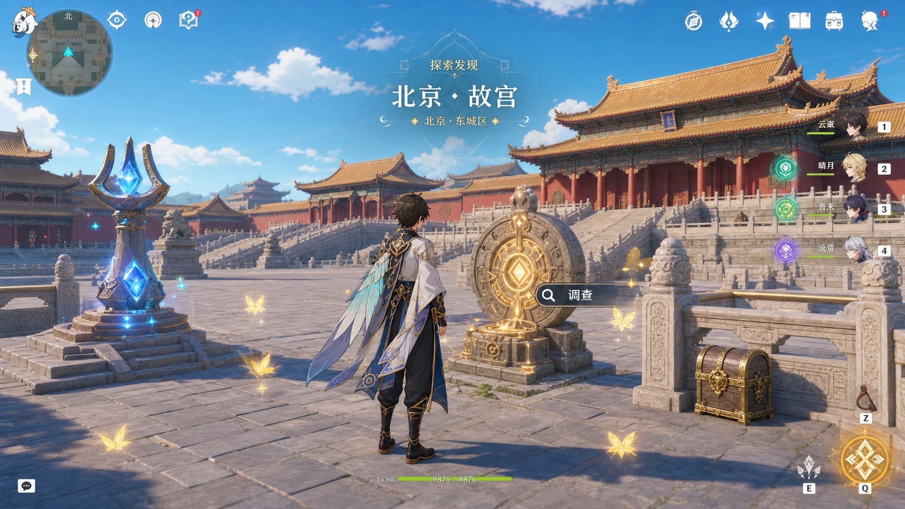 | 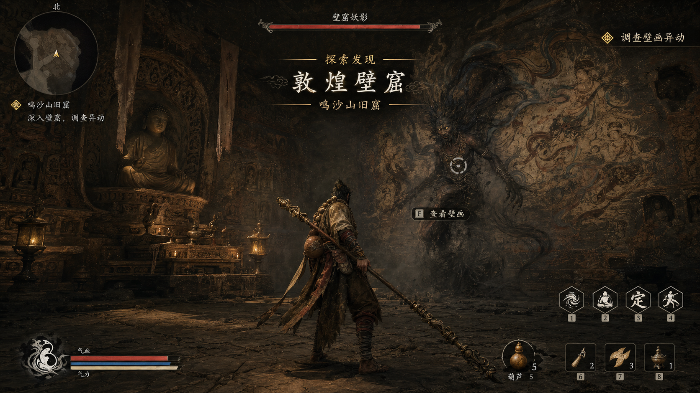 |

| Eastern Cultivation / Xianxia | Victorian Steam Occult Mystery |
|---|---|
| 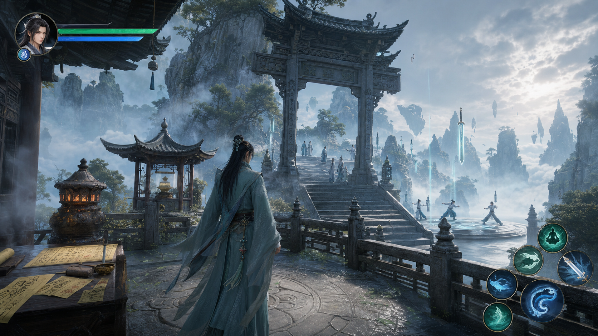 | 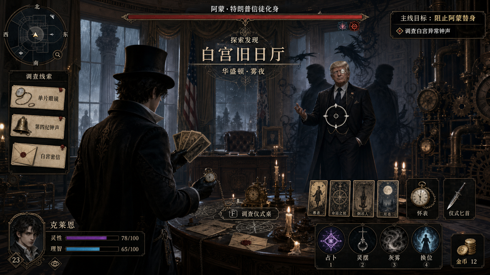 |

| Colorful Creature-Collection Adventure | Cozy Pixel Farming |
|---|---|
| 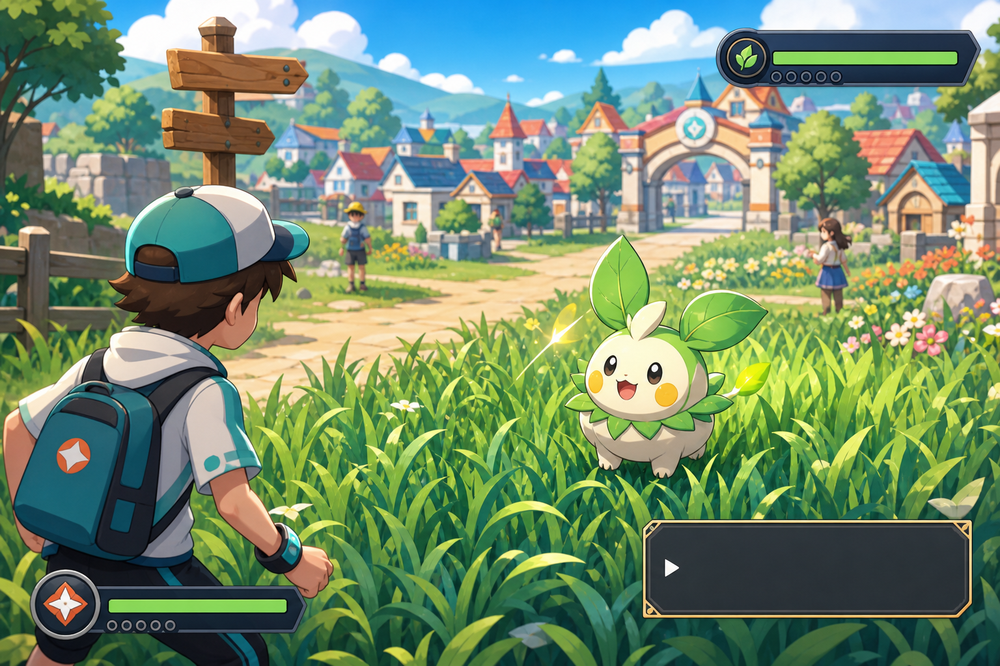 | 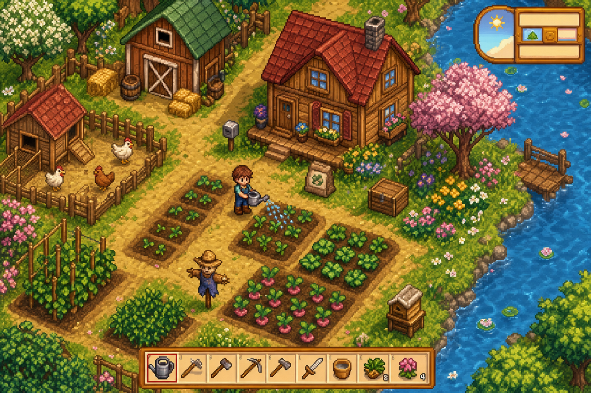 |

| Pixel Underwater Adventure | Crochet / Yarn-Knit Miniature |
|---|---|
| 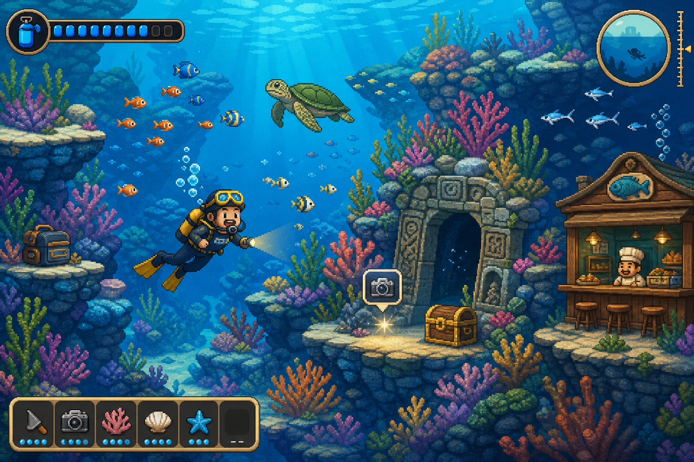 | 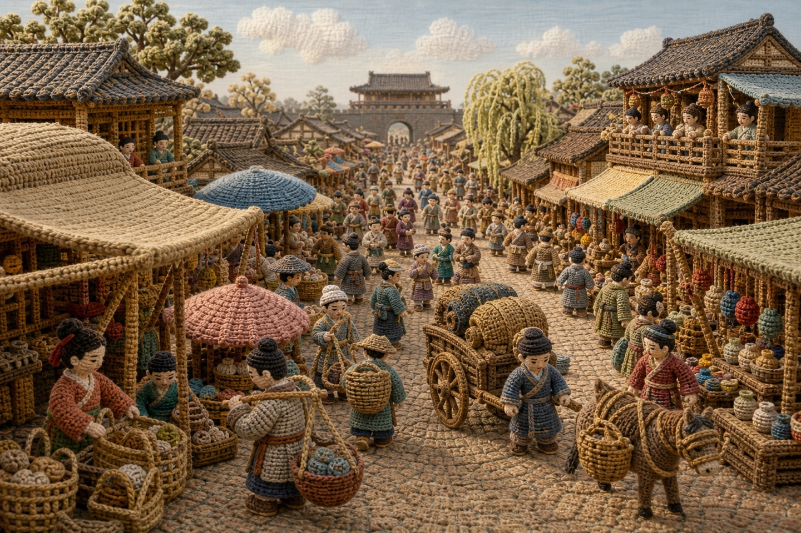 |

### Presentation Formats

The same style template can be carried into different presentation formats when the source material and request are suitable.

| 2D Image | 360° Panorama |
|---|---|
| 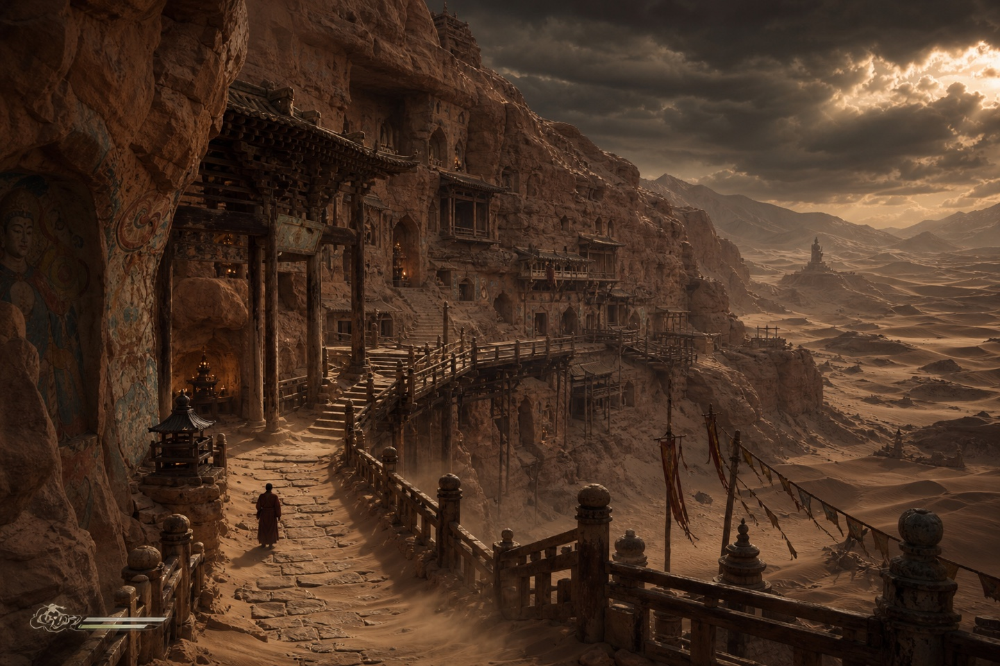 | 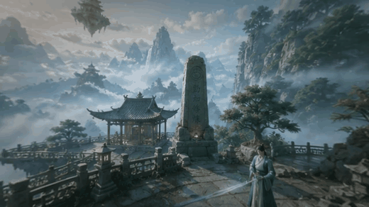 |

| Spatial-Depth Image | Colored Point Cloud |
|---|---|
| 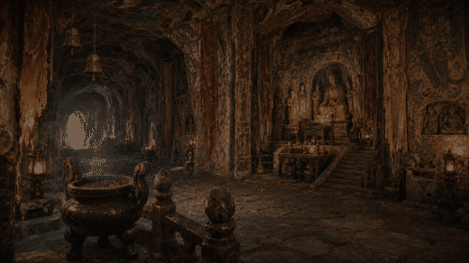 | 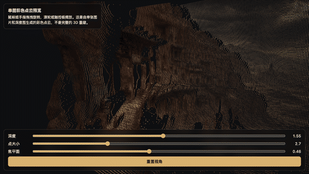 |

<details>
<summary>View the dynamic-enhanced 360° panorama demonstration</summary>

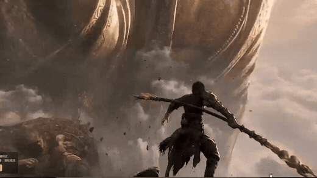

</details>

## Core Capabilities

- Direct image generation from natural-language requests.
- Prompt-only mode when the user asks for a prompt instead of an image.
- Uploaded-photo references: accept any number of reference images and assign identity, scene, clothing/prop, composition, or style roles from the user's instructions or visible image content. By default, the workflow preserves identity anchors while redesigning clothing, action, and lighting to integrate the person into the target world. Original clothing, poses, or props are preserved only when explicitly requested.
- Unified style transfer: when a real-person photo is used, the person, face, clothing, props, and background are prompted to be redrawn into one coherent target style instead of pasted together.
- Lightweight, full, or no UI/HUD modes.
- Real landmark stylization while keeping the main subject recognizable.
- Crochet / yarn-knit scenes that consistently translate people, buildings, streets, skies, and props into a tactile miniature world, including historical-painting and long-scroll scene reconstruction.
- 360° panorama workflow: 360°×180° equirectangular prompting, 2:1 ratio normalization, static HTML previews, and dynamic-enhanced HTML previews.
- Spatial depth image / spatial photo preview workflow: automatically reuse an uploaded or recently generated image, infer real model depth with Depth Anything V2, stabilize the depth map, and create a single-depth-mesh HTML viewer with automatic drift, direct interaction, and Space / Motion / Perspective sliders.
- Colored point-cloud preview: sample the source image and real depth into rotatable, zoomable colored points with depth, point-size, and focal-plane controls. This is a single-image depth point cloud, not a full 3D reconstruction.
- BigModel/CogVideoX video workflow: supports text-to-video and image-to-video; on macOS the first secure entry is saved to Keychain and automatically reused without writing the key to files or chat.

## Supported Style Directions

| Style Direction | Best For |
|---|---|
| Open-world fantasy adventure | Landmarks, exploration scenes, elemental mechanisms, bright fantasy maps |
| Dark Chinese myth | Ancient temples, stone grottoes, forest paths, action RPG atmosphere |
| Eastern cultivation / xianxia | Mountain sects, cave cultivation, alchemy, flying sword light |
| Victorian steam occult mystery | Foggy alleys, detective scenes, rituals, churches, brass machinery |
| Colorful creature-collection adventure | Original trainers, original companion creatures, routes, turn-based encounters |
| Cozy pixel farming | Farms, towns, crops, tools, seasonal life |
| Pixel underwater adventure | Diving, coral reefs, fish schools, ruins, light management adventure |
| Crochet / yarn-knit miniature | People, historical streets, architecture, daily-life scenes, still life, and 360° panoramas |

## Installation

Copy the skill folder into your Codex skills directory:

```bash
mkdir -p ~/.codex/skills
cp -R multi-style-image-generator ~/.codex/skills/
```

Restart Codex after installation, then invoke it with:

```text
Use $multi-style-image-generator to generate an eastern cultivation-style mountain sect entrance.
```

Prompt-only work, BigModel/CogVideoX video, image extraction, and the 360 HTML viewer scripts use only the Python standard library. Spatial depth images and 2:1 normalization run through an isolated launcher environment. `requirements.txt` includes Pillow / NumPy plus PyTorch / Transformers, Safetensors, and Hugging Face Hub for real depth inference. The first run installs these packages automatically in `multi-style-image-generator/.venv`; the first spatial-depth request also downloads the Depth Anything V2 Small model. Later runs reuse both the environment and Hugging Face cache, with no manual `pip` command required.

To prepare the dependencies manually, first enter the Skill directory and run:

```bash
cd multi-style-image-generator
python3 scripts/run_with_deps.py create_spatial_preview.py --help
```

The first download requires network access. If installation fails because of network or proxy settings, fix the Python/pip proxy or certificate configuration and retry the same launcher command; do not switch to global `pip` or `sudo`. To reset, run `python3 scripts/run_with_deps.py --reset` from the Skill directory; it deletes only the Skill's own `.venv` and `.deps-state.json`, and the next run recreates them.

## How To Use

In everyday use, mention this skill in Codex and describe the style, scene, UI mode, and output type:

```text
Use $multi-style-image-generator to generate an open-world fantasy gameplay-style image of Beijing's Forbidden City with lightweight UI. Generate the image directly.
```

Common phrases:

| Desired Result | Recommended Phrase |
|---|---|
| Prompt only | `Return only the prompt; do not generate an image` |
| Normal image | `Generate the image directly` |
| Full game interface | `Full UI` |
| Small location UI | `Lightweight UI` |
| No text or HUD | `No UI` |
| 360° panorama | `360°×180° equirectangular panorama, 2:1 aspect ratio, seamless left and right edges` |
| Spatial depth image / spatial photo | `Create a spatial depth image from the current image`; real depth, stabilized depth, and interactive HTML are generated automatically without mode parameters |
| Colored point cloud | `Create a colored point cloud from the current image`; real depth, stabilized depth, and a rotatable point-cloud HTML viewer are generated automatically |
| Image-to-video | `Turn this image into a 5-second video` |
| 360° panorama image-to-video | `First generate a 2:1 panorama, then animate it and create a 360° panorama video preview HTML file` |

Video mode requires a BigModel/CogVideoX API key. On the first video generation on macOS, a native hidden-input dialog appears and saves the key securely in Keychain. Later requests automatically reuse it. Never paste a real key into Codex chat, the README, scripts, or commit history.

```bash
python3 multi-style-image-generator/scripts/create_bigmodel_video.py --prompt "candle flames moving gently" --image path/to/image.png
```

Replace or forget the saved key:

```bash
python3 multi-style-image-generator/scripts/create_bigmodel_video.py --replace-api-key
python3 multi-style-image-generator/scripts/create_bigmodel_video.py --forget-api-key
```

`BIGMODEL_API_KEY` or `ZHIPU_API_KEY` can still temporarily override the saved Keychain value. The repository ignores `.env`, key files, `*-submit.json`, `*-result.json`, and `output/` to reduce the chance of committing local keys, task responses, or generated artifacts.

## Example Requests

Generate a normal image:

```text
Use $multi-style-image-generator to generate a Victorian steam-occult version of the Forbidden City with lightweight UI. Generate the image directly.
```

Stylize uploaded photos:

```text
Use $multi-style-image-generator to transform my uploaded portrait into an eastern cultivation style. Preserve recognizable identity while redesigning clothing, action, and lighting for the cultivation world, with the person naturally participating in the scene. Redraw the person and environment coherently; avoid photo collage artifacts, modern-clothing mismatch, and posed group-photo composition.
```

Prompt-only mode:

```text
Use $multi-style-image-generator to write a prompt for a dark Chinese-myth battle at an ancient temple. Do not generate an image.
```

Generate a 360° panorama and interactive preview:

```text
Use $multi-style-image-generator to generate an eastern cultivation-style 360°×180° equirectangular panorama with a 2:1 aspect ratio and seamless left and right edges, then create an interactive 360° panorama preview HTML file.
```

Generate a dynamic-enhanced 360 preview:

```text
Use $multi-style-image-generator to generate an eastern cultivation-style 360° panorama and a dynamic-enhanced preview HTML with mist, spirit particles, and automatic camera drift.
```

Generate a spatial photo preview:

```text
Use $multi-style-image-generator to create a spatial depth image from the current image, using real depth and an interactive spatial-photo HTML preview.
```

Generate a crochet / yarn-knit scene:

```text
Use $multi-style-image-generator with the original Along the River During the Qingming Festival as reference. Rebuild the right-side city street as a crochet and yarn-knit miniature scene, translating people, buildings, roads, stalls, and sky into one coherent textile world with rich but harmonious color. Generate the image directly.
```

Generate a colored point cloud:

```text
Use $multi-style-image-generator to create a colored point cloud from the current Dunhuang image, using real depth and a point-cloud HTML viewer with drag rotation and wheel zoom.
```

Generate a video:

```text
Use $multi-style-image-generator to turn this Dunhuang grotto image into a 5-second video with a slow camera push-in, gently moving candle flames, and drifting dust.
```

## 360° Panorama Notes

The preferred name is “360° panorama”; the complete technical term is “360°×180° equirectangular panorama.” It normally uses a 2:1 aspect ratio with seamless left and right edges. The skill still accepts informal Chinese aliases such as “环景” and “环景照.”

For 360° panorama requests, the skill asks the image generator for a 2:1 equirectangular panorama and then verifies the result. If the model returns a non-2:1 image, the helper script creates a `-2x1.png` normalized version before building the HTML panorama preview.

Normalization fixes the file ratio only. It cannot turn an ordinary wide image into a geometrically perfect seamless panorama. For best results, include these phrases in the user request:

```text
360°×180° equirectangular panorama, 2:1 aspect ratio, seamless left and right edges
```

The dynamic-enhanced viewer is not a video. It keeps the 2:1 panorama as a static base image and adds real-time WebGL / Canvas effects such as camera drift, mist, spirit particles, glow, and subtle FOV breathing.

The 360 example in this README is shown as a GIF so it can be viewed directly on the project homepage without opening a separate media file.

## Spatial Photo Preview Notes

The default keeps depth, motion and perspective sliders plus an automatic-tour toggle: `0.62 / 0.56 / 1.15`, with automatic X/Y amplitudes `0.36 / 0.18`. Use `--controls hidden` only when explicitly requested. A source image without HUD does not hide viewer controls.

Single-image depth point clouds use adaptive sampling, depth-aware soft points and discontinuity cleanup, with bounded angles that avoid unknown backsides. `--demo on` enables a pausable side/front/side orbit; dragging or resetting stops it. Depth, point size, focal plane and reset remain available. Depth stays at higher precision until 16-bit output; edge-aware smoothing and mesh discontinuity rejection reduce stretched silhouettes. Existing 8-bit inputs remain supported but cannot regain lost precision.

`--preset` now accepts only `immersive`; the ineffective `v18/legacy` aliases were removed. Requests for a styled point cloud or spatial image without a source first generate and inspect the image, then derive the viewer. Existing sources are reused. Skill details load progressively by style, source and presentation format.


Spatial depth images are for ordinary images, not 360 panoramas. When the user has uploaded an image or the conversation has just generated one, the skill reuses that current image without asking for another upload. If the user first asks to place a person into a new scene, the workflow generates and checks the integrated base image before deriving the spatial preview.

The default flow does not ask the user to choose technical parameters:

- Depth Anything V2 Small infers raw depth, then the workflow creates a stabilized depth map matching the source dimensions. It does not silently substitute heuristic depth.
- A single depth mesh powers the immersive HTML viewer with automatic drift, mouse, touch, and device-orientation input. Three live sliders—Space, Motion, and Perspective—plus an auto-tour toggle appear at the bottom by default.
- The restrained motion and perspective of the historical demo remain the default, with no depth blur unless `--blur depth` is explicitly requested.
- The HTML embeds the RGB image and stabilized depth map and opens directly over `file://`. Standard deliverables are raw depth, stabilized depth PNG, and HTML; when an existing depth map is reused, only files actually generated are delivered.
- The `--depth-backend heuristic` fallback is used only when the user explicitly accepts a non-model quick preview, and its provenance is labeled `heuristic-fallback`.

Create a spatial photo preview:

```bash
python3 multi-style-image-generator/scripts/run_with_deps.py create_spatial_preview.py path/to/image.png --out-dir path/to/output
```

With an existing stabilized depth map:

```bash
python3 multi-style-image-generator/scripts/run_with_deps.py create_spatial_preview.py path/to/image.png --depth path/to/stable-depth.png --out-dir path/to/output
```

### Colored Point-Cloud Preview

Point-cloud mode shares the same real-depth entry point as spatial depth but uses a dedicated colored-point renderer. It supports mouse or touch rotation, wheel zoom, and Depth / Point Size / Focal Plane sliders. It visualizes spatial layers inferred from one image; it is not a full 3D scan or multi-view reconstruction.

```bash
python3 multi-style-image-generator/scripts/run_with_deps.py create_spatial_preview.py path/to/image.png --spatial-mode pointcloud --out-dir path/to/output
```

## Video Mode Notes

Video mode uses the BigModel/CogVideoX API. According to the [BigModel video generation API](https://docs.bigmodel.cn/api-reference/%E6%A8%A1%E5%9E%8B-api/%E8%A7%86%E9%A2%91%E7%94%9F%E6%88%90%E5%BC%82%E6%AD%A5), video duration defaults to 5 seconds and supports only 5 or 10 seconds; intermediate values such as 8 seconds are not supported. On macOS, the API key is handled securely through Keychain:

```bash
python3 multi-style-image-generator/scripts/create_bigmodel_video.py \
  --prompt "slow cinematic push-in, candle flames moving, dust drifting" \
  --image path/to/image.png \
  --model cogvideox-3 \
  --quality quality \
  --size 1920x1080 \
  --fps 30 \
  --with-audio
```

## Helper Scripts

Create a static interactive 360° panorama viewer:

```bash
python3 multi-style-image-generator/scripts/create_panorama_viewer.py path/to/panorama-2x1.png --embed-image
```

Create a dynamic-enhanced 360° panorama viewer:

```bash
python3 multi-style-image-generator/scripts/create_dynamic_panorama_viewer.py path/to/panorama-2x1.png
```

Create a spatial photo preview:

```bash
python3 multi-style-image-generator/scripts/run_with_deps.py create_spatial_preview.py path/to/image.png --out-dir path/to/output
```

Create a colored point-cloud preview:

```bash
python3 multi-style-image-generator/scripts/run_with_deps.py create_spatial_preview.py path/to/image.png --spatial-mode pointcloud --out-dir path/to/output
```

Generate a BigModel/CogVideoX video:

```bash
python3 multi-style-image-generator/scripts/create_bigmodel_video.py --prompt "slow cinematic push-in" --image path/to/image.png
```

Normalize a generated image to 2:1:

```bash
python3 multi-style-image-generator/scripts/run_with_deps.py normalize_equirectangular_aspect.py path/to/image.png
```

Extract the latest generated image from a Codex session log:

```bash
python3 multi-style-image-generator/scripts/extract_latest_image_from_session.py --out-dir output/imagegen --name my-panorama
```

## Repository Layout

```text
multi-style-image-generator/
├── README.md
├── README_en.md
├── assets/
│   └── examples/
└── multi-style-image-generator/
    ├── SKILL.md
    ├── agents/
    │   └── openai.yaml
    ├── evals/
    │   └── evals.json
    ├── references/
    │   ├── game-visual-styles.md
    │   └── portrait-panorama-qa.md
    ├── assets/
    │   ├── pointcloud-template.html
    │   └── spatial-v18-template.html
    ├── tests/
    │   └── test_spatial_v18.py
    └── scripts/
        ├── create_pointcloud_viewer.py
        └── create_spatial_preview.py
```

## Requirements

- Python 3.9+
- Prompting, BigModel/CogVideoX video, image extraction, and the 360 HTML viewer scripts require only the Python standard library
- The launcher automatically installs Pillow / NumPy plus PyTorch / Transformers, Safetensors, and Hugging Face Hub for real spatial-depth inference into `multi-style-image-generator/.venv`
- The first spatial-depth request downloads the Depth Anything V2 Small model; later runs reuse the Hugging Face cache. Initial setup requires network access and uses more time and disk space than ordinary image generation
- A modern browser with WebGL support for the 360, dynamic-enhanced, spatial-depth, and colored point-cloud preview HTML
- Frame-sequence previews can optionally use the system `ffmpeg`; detect it with `command -v ffmpeg` and install it yourself if missing (for example, `brew install ffmpeg` on macOS), because the Skill never installs system software automatically

The static and dynamic preview HTML files are standalone when generated with embedded image data.

BigModel/CogVideoX API keys are unrelated to Python package installation. On macOS, the default flow uses a native dialog and Keychain for secure storage and automatic reuse; environment variables remain available as temporary overrides. The Skill never writes the key to the repository, generated files, or chat.

## License

This project is released under the [PolyForm Noncommercial License 1.0.0](LICENSE). Personal, educational, research, and other noncommercial uses are permitted. Commercial use, commercial integration, commercial deployment, or redistribution for profit requires separate written permission.

## Author & Community

- Email: 247133278@qq.com
- WeChat: loonges
- QQ: 247133278
- Xiaohongshu / Bilibili: 好奇的小逸
